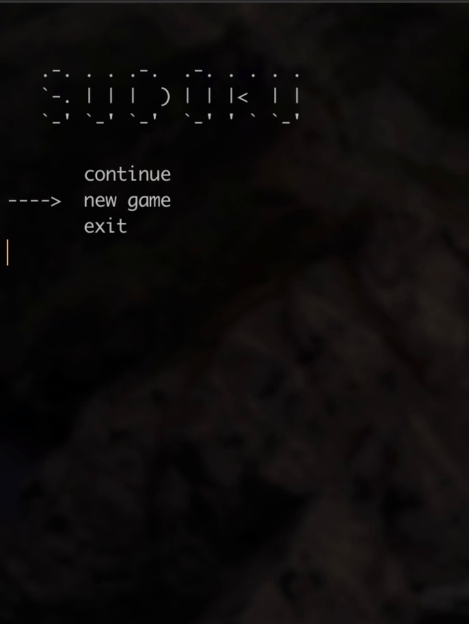

# **Sudoku Game** :+1:

Just a simple clone of the famous game Sudoku.





## Licence

[](http://creativecommons.org/publicdomain/zero/1.0/)
Feel free to use


## Algorithm for creating Sudoku board

```
void swap(int num1, int num2, bool ifColumn)
{

    int temporary = 0;
    for (int i = 0; i < 9; i++)
    {
        if (ifColumn == 1)
        {
            temporary = goodBoard[num1][i];
            goodBoard[num1][i] = goodBoard[num2][i];
            goodBoard[num2][i] = temporary;
        }
        else
        {
            temporary = goodBoard[i][num1];
            goodBoard[i][num1] = goodBoard[i][num2];
            goodBoard[i][num2] = temporary;
        }
    }
    return;
}

void generateBoard(void)
{
    srand(time(NULL));
    int n, m;
    n = (rand() % 3) * 3;
    m = rand() % 1;
    for (int i = 0; i < SHUFFLES; i++)
    {
        switch (rand() % 6)
        {
        case 0:
            swap(n + 0, m ? n + 1 : n + 2, false);
            break;
        case 1:
            swap(n + 1, m ? n + 0 : n + 2, false);
            break;
        case 2:
            swap(n + 2, m ? n + 0 : n + 1, false);
            break;
        case 3:
            swap(n + 0, m ? n + 1 : n + 2, true);
            break;
        case 4:
            swap(n + 1, m ? n + 0 : n + 2, true);
            break;
        case 5:
            swap(n + 2, m ? n + 0 : n + 1, true);
            break;
        }
    }
}
```
