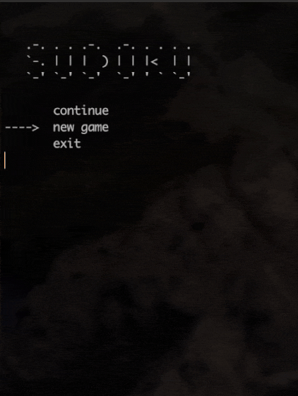

# **Sudoku Game** :+1:

Just a simple clone of the famous game Sudoku.

## About

It's a university project. I'm sorry for all the mistakes. This is my first program in C.

This program generates a different board each time or downloads the board from a file.

## How to install?

- Download all files
- Open the path in the terminal
- Type  `make`
- Type  `make run`

## Licence

Feel free to use
